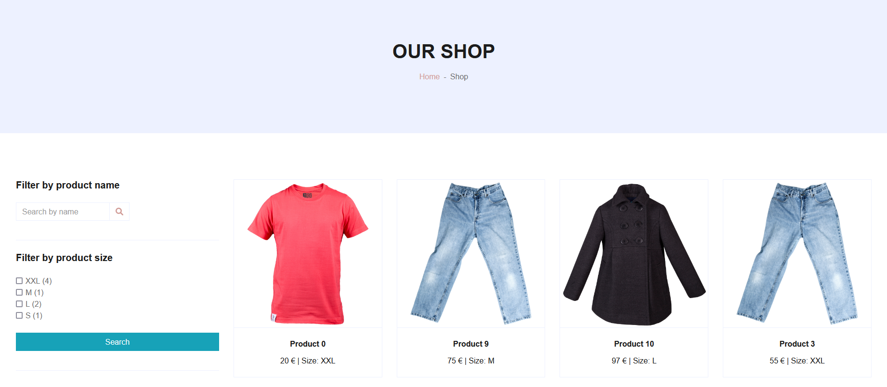

# Project Description
This is small project to learn how to use filter with Symfony.

## Overview

## Requirements
  1.PHP 8  
  2.Symfony cli altest versiion

## Installation
  1.Setup your driver from the .env file  
  2.Run these commands :  
    - symfony console doctrine:database:create  
    - symfony console doctrine:migration:migrate  
    - symfony console doctrine:fixture:load // Generate data from the Fixture  